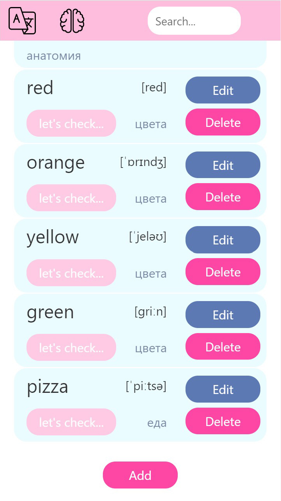
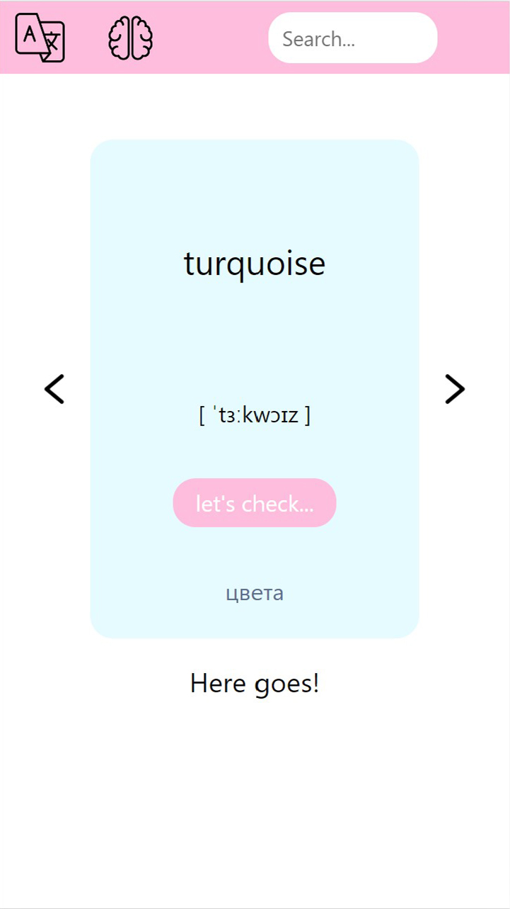

# Flashcard App

Application for learning English words &#128292;

## Description

With the application you can learn English words. There is a dictionary and training mode. You can add and remove words from the dictionary, as well as change them.

## Technology stack

## Result

<!-- [Сlick me](https://annapushka.github.io/bookshop/) -->

## Authors

Pushkareva Anna 
[@AnnaPushka](https://github.com/annapushka)

